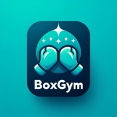

# BoxGym

> **Warning**
> Link Github Pages: https://kdjyago.github.io/BoxGym/

## App de boxeo

La aplicación desarrollada en este proyecto, llamada BoxGym, es una herramienta para la programación y seguimiento de entrenamientos de boxeo, con un sistema de recompensas que permite a los usuarios canjear puntos por personalizaciones. La aplicación ha sido desarrollada utilizando Flutterflow y el lenguaje Dart.

 

## Objetivos

BoxGym no solo facilita la organización de entrenamientos de boxeo, sino que también busca fomentar la práctica de este deporte entre la sociedad. El boxeo es una disciplina que mejora la condición física, la coordinación, la disciplina y el bienestar mental. Con BoxGym, se pretende hacer más accesible y atractiva la práctica del boxeo, incentivando a las personas a adoptar hábitos de vida saludables. Introduciendo así un deporte a la sociedad que cada vez está cogiendo más fuerza.

